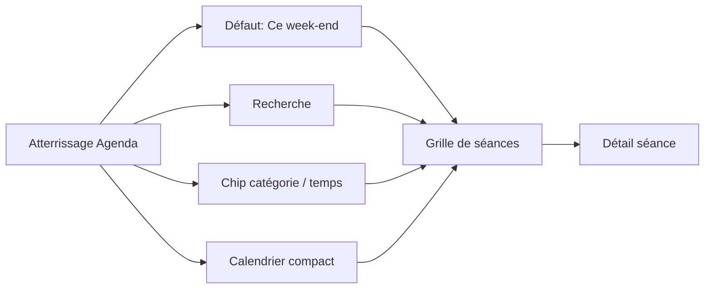

# Brief design CultureConnect
**Produit** : agenda culturel Toulouse & alentours  
**Live** : https://culture-connect-2q8c-three.vercel.app/  
**Repo** : https://github.com/edosdat/CultureConnect (Next.js 15, Tailwind)  
**Date** : 24 août 2026  
**Auteur** : Agent design site culturel  
**Public** : Eloi + agent *site web culture connect*

---

## 1. Vision

CultureConnect répond à une seule question :

> **« Qu’est-ce que je fais ce soir / ce week-end à Toulouse ? »**

Tout le reste (calendrier mois, filtres, artistes, lieux) est au service de cette question.

### Ambition ressentie
| Mot | Traduction produit |
|-----|-------------------|
| **Fluide** | 0–1 clic pour voir des sorties utiles ; pas de sidebar obligatoire |
| **Joli** | Éditorial, photos, typo soignée, cartes aérées |
| **Vibrant** | Couleur par catégorie, CTA chaud, énergie sans cacophonie |
| **Confiance** | Horaires / tarifs / lieu clairs ; source officielle ; zéro placeholder scrape |
| **Simple** | Une home, une recherche, des chips, des cartes |

### Principes non négociables
1. **Séance d’abord** — l’unité visible = une sortie possible (date + heure + lieu).
2. **Moins de surface, plus de signal** — chaque pixel doit aider à choisir.
3. **Défaut intelligent** — arriver sur « Ce week-end » (ou « Ce soir » après 17h), pas sur « tout le mois ».
4. **Confiance visible** — jamais de slug brut, note de scrape, image fantôme répétée.
5. **Mobile = desktop** — mêmes objets, densité adaptée ; pas deux produits.

---

## 2. Modèle d’objets (ce qu’on montre)

Aligné sur les CSV existants.

### Objets principaux

| Objet UI | Source data | Rôle |
|----------|-------------|------|
| **Séance** | `programme` (+ join event / lieu / artiste) | Carte principale de l’agenda |
| **Événement (cadre)** | `evenements` | Expo / festival multi-jours ; badge « Sur la période » |
| **Lieu** | `lieux` | Fiche légère + lien programmation officielle |
| **Artiste** | `artistes` | Page `/artistes` + entrée depuis une séance |
| **Catégorie** | 6 buckets fixes | Filtre primaire |
| **Genre** | `genres_legend` | Filtre secondaire, **après** catégorie |

### Règles d’affichage
- **1 carte = 1 séance** (ou 1 jour d’un cadre période, clairement marqué).
- Ne plus afficher de compteur du type « 1067 éléments » : préférer  
  `« 24 sorties ce week-end »` / `« 8 ce soir »`.
- Un **cadre multi-jours** (expo) n’apparaît **qu’une fois par jour concerné**, avec badge `Sur la période`, pas une fois par « élément » fantôme.
- Labels toujours humanisés via `genres_legend` (jamais de slug `hip_hop_rap`).

### Contenu carte séance (ordre)
1. Visuel (image_url si dispo, sinon dégradé catégorie — **pas** de photo stock répétée)
2. Pastille catégorie (couleur)
3. Titre (serif)
4. Heure · Tarif (ou Gratuit)
5. Lieu · Ville
6. Optionnel : artiste(s), badge période

Footer discret : `via programmation du lieu` (confiance / sourcing).

---

## 3. Architecture d’information & navigation

### Pages
| Route | Nom | Rôle |
|-------|-----|------|
| `/` | **Agenda** | Home unique (remplace Accueil + Événements) |
| `/artistes` | **Artistes** | Découverte artistes / DJs |
| (modal ou `/seance/[id]`) | Détail séance | Ouverture depuis une carte |
| (modal ou `/lieu/[id]`) | Lieu | Secondaire |
| (modal déjà) | Artiste | Depuis `/artistes` ou séance |

### Nav desktop
`CultureConnect` (logo) · **Agenda** · **Artistes**  
(+ recherche sticky à droite ou pleine largeur sous la nav)

### Nav mobile
Bottom bar : **Agenda** · **Chercher** · **Artistes**  
Filtres → bottom sheet, jamais sidebar.

---

## 4. Parcours cibles (peu de clics)

### Parcours A — Découvrir sans réflexion (priorité #1)
1. Atterrissage `/` déjà filtré **Ce week-end** (ou **Ce soir** après 17h)
2. Grille de 6–12 cartes visibles above the fold
3. Clic carte → détail / billet

**Clics : 0 pour voir, 1 pour décider.**

### Parcours B — Affiner
Chips temps (`Ce soir` · `Ce week-end` · `Cette semaine` · `Choisir une date`)  
+ chips catégories  
+ recherche si besoin  
Genres n’apparaissent **qu’après** une catégorie.

### Parcours C — « Je cherche un artiste / un lieu »
Recherche universelle → suggestions → séance ou fiche artiste/lieu.

### Parcours D — Calendrier mois (secondaire)
Accessible via `Choisir une date` ou icône calendrier compacte.  
Le mois n’est **plus** le centre de la home.

---

## 5. Écrans

### 5.1 Home Agenda `/` (refonte majeure)

**Structure verticale (desktop)**  
1. Header : logo + nav + recherche  
2. Bandeau temps : `Ce soir` | `Ce week-end` ★ | `Cette semaine` | `Date…`  
3. Rangée catégories : 6 chips (scroll horizontal mobile)  
4. Ligne contexte : `24 sorties · week-end 29–30 août` + lien `Voir le mois`  
5. **Grille de cartes séances** (2–3 colonnes desktop, 1 mobile)  
6. Genres (si catégorie active) en chips sous les catégories  

**À retirer de la home primaire**
- Sidebar sticky gauche (catégories / genres / lieux en colonne)
- Calendrier mois comme colonne centrale dominante
- Liste interminable « tout le mois » dès l’arrivée

**Calendrier mois**  
Mode compact : drawer / panneau latéral / page légère, synchronisé avec la grille.  
Compteurs par jour = **nombre de séances**, pas d’éléments dilués.

**Filtre lieux**  
Pas dans une sidebar permanente :  
- soit dans la recherche (`Halle de la Machine`)  
- soit chip `Lieu` qui ouvre un combobox / sheet

### 5.2 Détail séance (modal prioritaire)
- Grande image / dégradé catégorie  
- Titre, catégorie, genre  
- Date · heure · durée si connue  
- Lieu + adresse / ville + lien map  
- Tarif + CTA `Réserver / Site du lieu` (url officielle)  
- Description longue si dispo  
- Artistes liés (chips cliquables)  
- Si cadre période : bloc « Aussi les … » (autres jours)  
- Pied : source programmation officielle

### 5.3 Artistes `/artistes`
Conserver l’esprit actuel (propre, éditorial), en l’alignant :
- Recherche sticky + genres musicaux (OK)
- Cartes avec **visuel** dès que `image_url` / photo artiste existe
- Clic → modal : bio + **prochaines séances** (cartes compactes), pas seulement « 1 date à venir »
- Même palette / radius / typo que l’Agenda

### 5.4 Mobile
- Bottom nav  
- Temps + catégories en chips scrollables (une ligne chacune)  
- Grille 1 colonne, cartes ~140–160px de haut image  
- Filtres avancés = sheet  
- Éviter overflow horizontal (déjà en cours de fix)

---

## 6. Recherche & filtres

### Recherche universelle (header sticky)
Placeholder rotatif / fixe :  
`Titre, artiste, lieu, genre…`

Suggestions (max 6) groupées :
- Séances
- Artistes
- Lieux
- Raccourcis (`Jazz ce soir`, `Gratuit demain`)

Entrée clavier → résultats mixtes, séances en premier.

### Filtres (ordre mental)
1. **Temps** (défaut intelligent)  
2. **Catégorie** (0–1)  
3. **Genre** (seulement si catégorie)  
4. **Lieu** (optionnel)  
5. Extras plus tard : Gratuit, En plein air, Famille…

### États vides
Message humain + action :  
`Rien ce soir en Cinéma — voir ce week-end` (bouton).

---

## 7. Système visuel

### 7.1 Couleurs

| Token | Hex | Usage |
|-------|-----|--------|
| `bg` | `#F7F0E8` | Fond crème chaud |
| `surface` | `#FFFCF8` | Cartes |
| `ink` | `#1C1917` | Texte principal |
| `ink-muted` | `#57534E` | Secondaire (jamais trop pâle) |
| `accent` | `#E85D3B` | CTA, chip temps actif, focus |
| `accent-soft` | `#F6D5C8` | Fond chip actif léger |
| `line` | `#E7E0D8` | Bordures |

**Catégories (pastilles + teinte carte si pas d’image)**

| Catégorie | Couleur |
|-----------|---------|
| Musique | `#E85D3B` corail |
| Théâtre & danse | `#7C3A6E` prune |
| Festival | `#D97706` ambre |
| Cinéma | `#3730A3` indigo |
| Expo & patrimoine | `#5F7A5A` sauge |
| Enfants / familles | `#0F766E` turquoise |

Vibrant = saturation des pastilles + CTA, **pas** un fond criard.  
Le crème + serif gardent la confiance éditoriale.

### 7.2 Typographie
- **Titres / noms** : serif éditorial (ex. Fraunces, Source Serif, ou serif actuelle si déjà chargée)
- **UI** : sans (Inter / system / Geist)
- Échelle indicative : H1 home ~40–48px · titre carte ~18–20px · meta 13–14px
- Éviter les WALL OF CAPS sauf micro-labels (`TOULOUSE & ALENTOURS`)

### 7.3 Forme & motion
- Radius cartes : 16–20px  
- Chips : pill full  
- Ombres : très soft (`0 8px 24px rgba(28,25,23,0.06)`)  
- Hover carte : léger lift + image zoom 1.03  
- Transitions 150–200ms, ease-out  
- Pas de motion gadget sur le calendrier

### 7.4 Iconographie
Line icons simples (temps, lieu, billet). Une seule famille.

---

## 8. Composants (cible front)

Mapping utile pour l’agent Culture Connect (existant ≈ à faire évoluer) :

| Composant | Rôle | Évolution |
|-----------|------|-----------|
| `CultureConnectApp` | Shell | Nav Agenda/Artistes + search sticky |
| `TimeScopeBar` **(new)** | Ce soir / week-end / semaine / date | Remplace le « mois d’abord » |
| `CategoryChips` | 6 catégories | Remplace sidebar `CategoryFilter` en primary |
| `GenreChips` | Après catégorie | Comme aujourd’hui, mais inline |
| `SearchOmnibox` **(new)** | Recherche universelle | Header |
| `SeanceCard` **(new/évol)** | Carte sortie | Cœur de la home |
| `SeanceGrid` **(new)** | Grille | Remplace liste mois dominante |
| `MonthCalendar` | Mois | Mode compact / secondaire |
| `DayEvents` | Liste jour | Alimente grille ou drawer jour |
| `SeanceDetailModal` | Détail | Enrichir image, CTA, source |
| `ArtistCard` / modal | Artistes | Aligner tokens + prochaines séances |
| `EmptyState` | Zéro résultat | Avec action de repli |
| `SourceBadge` | Confiance | « via programmation du lieu » |

---

## 9. Contenu & confiance

### Toujours montrer
- Heure (ou plage)  
- Lieu nommé  
- Tarif ou Gratuit / Prix non communiqué (formulation honnête)  
- Catégorie lisible  

### Ne jamais montrer
- Notes de scrape, debug, slugs  
- Placeholders image identiques en boucle  
- Compteurs dilués multi-jours  

### Images
1. `image_url` événement / séance si fiable  
2. Sinon dégradé + monogramme catégorie (élégant)  
3. Enrichissement progressif OK — le design doit **assumer** l’absence d’image sans avoir l’air cassé  

### Source
Lien ou mention discrète vers la page programmation officielle du lieu (règle produit déjà actée).

---

## 10. Copy (ton)

- Tutoiement possible sur microcopy produit (`Tu peux aussi voir ce week-end`) — à valider avec Eloi ; sinon vouvoiement neutre.
- Labels courts : `Ce soir`, `Gratuit`, `Réserver`
- Éviter le jargon data : pas d’« éléments », dire **sorties** ou **séances**

---

## 11. Accessibilité & perf
- Contraste texte ≥ AA sur crème  
- Focus visible terracotta  
- Hit targets chips ≥ 44px mobile  
- Images lazy ; LCP = première carte ou hero léger  
- Préférer CSS tokens Tailwind (`bg-cream`, `text-ink`, `bg-cat-musique`…)

---

## 12. Ce qu’on ne fait pas (anti-patterns QA)
- Fuite de filtres entre vues  
- Slugs bruts dans l’UI  
- Placeholders scrape publiés  
- Compteurs gonflés par cadres multi-jours  
- Nav doublon Accueil / Événements (déjà corrigé)  
- Overflow horizontal mobile  

---

## 13. Roadmap design → build

### P0 — Impact immédiat (fluide + confiance)
1. Défaut **Ce week-end** / **Ce soir** + `TimeScopeBar`  
2. Grille `SeanceCard` above the fold  
3. Sidebar → chips inline  
4. Calendrier mois en secondaire  
5. Nettoyage labels / compteurs / empty states  

### P1 — Joli + vibrant
6. Tokens couleur catégorie + accent saturé  
7. Recherche omnibox  
8. Modal détail enrichie (CTA + source)  
9. Artistes alignés + prochaines dates  

### P2 — Polish
10. Motion / hover  
11. Fiches lieu  
12. Raccourcis recherche (`Jazz ce soir`)  
13. Mode « Gratuit » / « En famille »  

---

## 14. Critères de succès (ressentis testables)
- En **0 clic**, un nouveau visiteur voit des sorties pertinentes pour le week-end.  
- En **≤ 2 clics**, il ouvre une séance avec tarif + lien utile.  
- Sur mobile, atteindre une séance utile **sans** scroller une sidebar.  
- Aucune carte avec slug / note technique.  
- Un utilisateur dit : « c’est clair, ça donne envie, j’ai confiance ».  

---

## 15. Décisions ouvertes (pour Eloi)
1. Tutoiement vs vouvoiement dans la microcopy  
2. Défaut après 17h : forcer **Ce soir** ou garder **Ce week-end** le ven/sam  
3. Détail séance : modal only vs aussi URL partageable `/seance/[id]`  
4. Nom produit affiché : garder **CultureConnect** ou sous-titre « Agenda Toulouse »

---

*Fin du brief. Prochaine étape possible : wireframes basse fidélité écran par écran, ou handoff tokens → Tailwind pour l’agent Culture Connect.*

---

## Annexe A — Audit live (24 août 2026)

Source : capture desktop https://culture-connect-2q8c-three.vercel.app/

### Constats qui renforcent le P0
- Défaut = mois entier ; premières cartes = début de mois, pas aujourd’hui.
- Pas de recherche sur `/` (Agenda).
- Fuites scrape encore visibles dans l’UI (ex. « Scrape https://odyssud.com/… », « Prog utile hors fenêtre stricte »).
- Densité cinéma (séances individuelles) noie concerts/spectacles → envisager regroupement film ou filtre « masquer horaires cinéma ».
- Aucune image / poster sur les cartes.
- Double zone de scroll (page + rail droit).
- Modal détail solide (source, lieu) — à garder et enrichir d’un vrai CTA.

### Screenshot
`/workspace/cc-shots/home-desktop.png`
